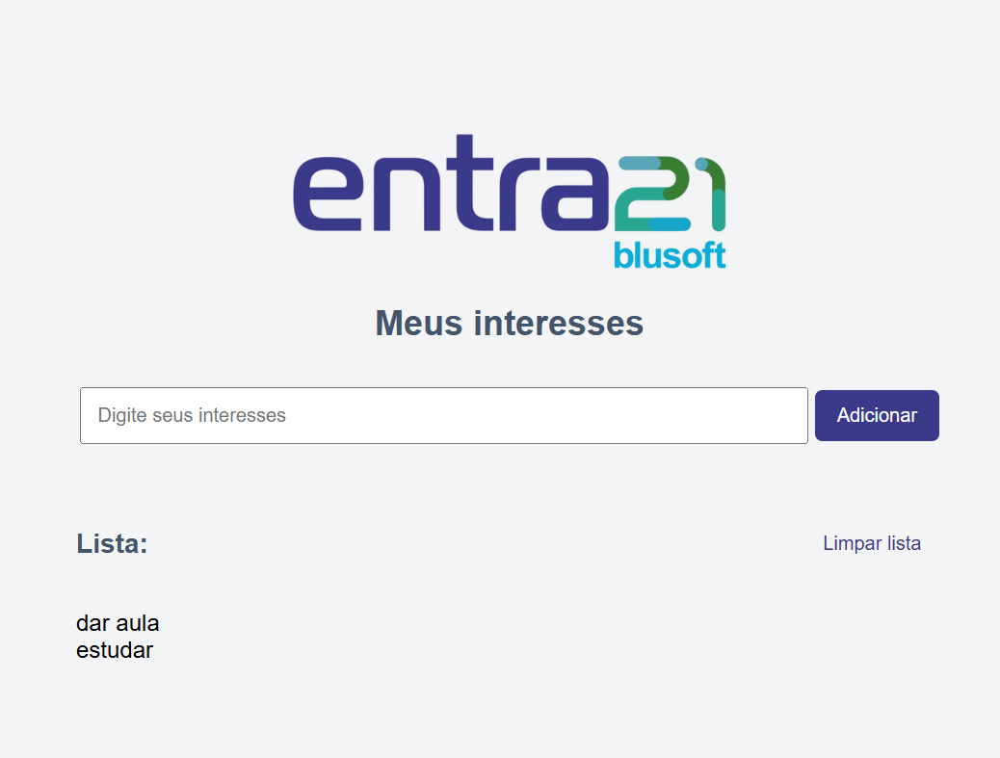

# 📋 Meus Interesses

Bem-vindo ao **Meus Interesses**, um mini-projeto interativo desenvolvido para ajudar você a organizar e visualizar seus interesses de forma simples e prática! 🚀

## 🧐 O que é este projeto?

Este é um projeto web básico que permite ao usuário:

- Adicionar itens a uma lista de interesses.
- Visualizar os itens adicionados.
- Limpar a lista com apenas um clique.

A ideia é criar uma experiência intuitiva e funcional, ideal para quem está aprendendo HTML, CSS e JavaScript.

---

## 🛠️ Tecnologias utilizadas

Este projeto foi desenvolvido utilizando as seguintes tecnologias:

- **HTML5**: Estrutura da página.
- **CSS3**: Estilização e layout responsivo.
- **JavaScript**: Funcionalidades interativas.

---

## 🎯 Funcionalidades

1. **Adicionar itens à lista**  
   Digite um interesse no campo de entrada e clique no botão **"Adicionar"** para incluí-lo na lista.

2. **Limpar a lista**  
   Clique no botão **"Limpar lista"** para remover todos os itens adicionados.

---

## 📂 Estrutura do projeto

- **index.html**: Estrutura principal da página.
- **style.css**: Estilos visuais para tornar a página atraente.
- **index.js**: Código JavaScript para adicionar interatividade.

---

## 🚀 Como executar o projeto?

1. **Clone o repositório ou baixe os arquivos.**
2. Abra o arquivo `index.html` em qualquer navegador moderno.
3. Pronto! Agora você pode interagir com a página.

---

## 🎨 Layout

A página possui um design simples e amigável, com:

- Um campo de entrada para digitar seus interesses.
- Botões estilizados para adicionar ou limpar a lista.
- Uma lista dinâmica que exibe os itens adicionados.

---

## 💡 Aprendizados

Este projeto é ideal para quem está começando a aprender desenvolvimento web. Ele aborda conceitos como:

- Manipulação do DOM com JavaScript.
- Estilização com CSS.
- Estruturação de páginas com HTML.

---

## 📸 Demonstração

---

## 📌 Próximos passos

Aqui estão algumas ideias para expandir o projeto:

- Adicionar a funcionalidade de remover itens específicos da lista.
- Salvar os itens no armazenamento local do navegador (localStorage).
- Melhorar o design com animações e transições.

---

## 🖋️ Autor

Desenvolvido com 💻 e ☕ por Julia Barbosa.

---
